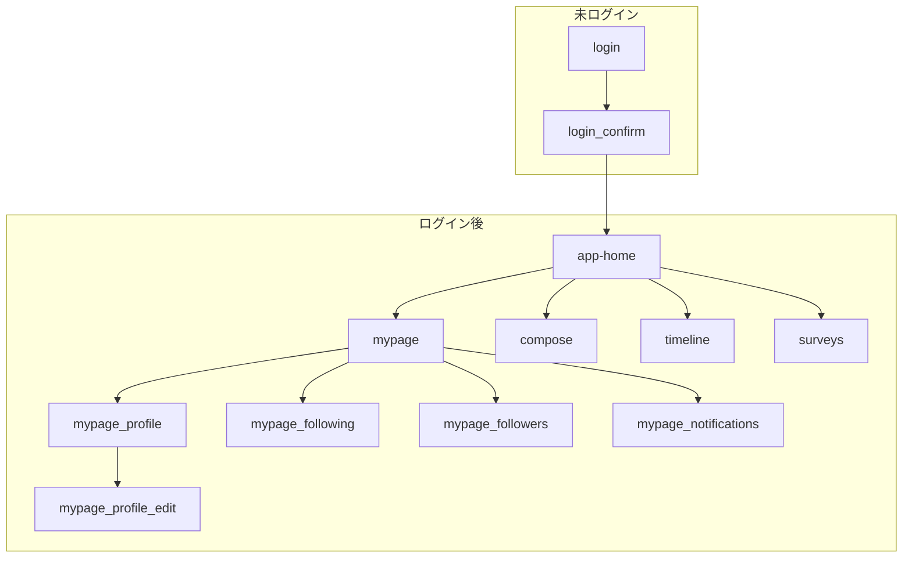

# 02_FRONTEND_SPEC.md: フロントエンド仕様書

## 0. 開発進捗とタスクの共有byえとー

### 雛形ベースができてURLが既に存在するページ
- Home
- Login
  - Login Confirm
- My Page
  - My Page Profile

### まだ開発中のページ
- timeline
- compose
- surveys

### 上記ページから派生するページの作成も必要
- 細かいページはFigmaを参照
- page/following
- page/followers
- page/profile/edit
- page/notifications
- compose-01
- compose-02
- timelineのタブバーの分岐
- surveysのタブバーの分岐

### 今考えられるタスク
- フッター周り
- 変数、定数の統一
- 画像の位置
- mypageのテキストが白字になってて見にくい
- アイコンの調整
- レスポンス設定（全ページ）
- 繰り返し使うヘッダーの整備（コンポーネント化したら使いまわせるはず）
- 画像がはみ出しており、サイズ調整が必要
- ボタンを押したときのページ変遷の実装

過去のプルリクエスト一覧でも各々のページにおける課題などが確認できます  
https://github.com/tech0-gen10-papas/papas-frontend/pulls?q=is%3Apr+is%3Aclosed

## 1. 技術スタック
- **フレームワーク:** Next.js (TypeScript, App Router)
- **UIライブラリ:** Tailwind CSS
- **コード品質:** ESLint, Prettier

## 2. ディレクトリ構造

現在の開発環境（Docker利用）・画像と実際のファイル構成を反映したディレクトリ例  
**Next.js App Routerのページ名称に準拠**

```text
papas-frontend/
├─ .devcontainer/
├─ .github/
├─ .next/
├─ node_modules/
├─ papas-docs/
├─ public/
│  ├─ icons/
│  └─ images/
│     ├─ file.svg
│     ├─ globe.svg
│     ├─ next.svg
│     ├─ vercel.svg
│     └─ window.svg
├─ src/
│  ├─ app/
│  │  ├─ login/                  # /login ログイン画面
│  │  │  └─ confirm/             # /login/confirm 認証確認画面
│  │  ├─ home/                   # /home ログイン後のメイン画面
│  │  ├─ timeline/               # /timeline タイムライン
│  │  ├─ compose/                # /compose 新規投稿画面
│  │  ├─ surveys/                # /surveys アンケート機能
│  │  ├─ mypage/                 # /mypage マイページ
│  │  │  ├─ profile/             # /mypage/profile プロフィール
│  │  │  │  └─ edit/             # /mypage/profile/edit プロフィール編集
│  │  │  ├─ following/           # /mypage/following フォロー中
│  │  │  ├─ followers/           # /mypage/followers フォロワー
│  │  │  └─ notifications/       # /mypage/notifications お知らせ
│  │  ├─ favicon.ico
│  │  ├─ globals.css
│  │  ├─ layout.tsx
│  │  └─ page.tsx
│  ├─ components/
│  │  ├─ ui/
│  │  └─ features/
│  ├─ lib/
│  ├─ styles/
│  ├─ types/
├─ .dockerignore
├─ .gitattributes
├─ .gitignore
├─ Dockerfile
├─ Dockerfile.dev
├─ package.json
├─ package-lock.json
├─ postcss.config.mjs
├─ README.md
├─ tsconfig.json
├─ next.config.ts
├─ eslint.config.mjs
├─ next-env.d.ts
├─ tailwind.config.ts           # Tailwind CSS 設定ファイル（新規追加）
```

- `src/app/login/`: ログイン画面
  - `src/app/login/confirm/`: 認証確認画面
- `src/app/home/`: ログイン後のメイン画面
- `src/app/timeline/`: タイムライン
- `src/app/compose/`: 新規投稿画面
- `src/app/surveys/`: アンケート機能
- `src/app/mypage/`: マイページ
  - `src/app/mypage/profile/`: プロフィール
    - `src/app/mypage/profile/edit/`: プロフィール編集
  - `src/app/mypage/following/`: フォロー中
  - `src/app/mypage/followers/`: フォロワー
  - `src/app/mypage/notifications/`: お知らせ

> ディレクトリ・URLは英語・小文字・ケバブケース・階層化で統一してください。

## 3. デザインからの実装フロー (Figma -> Code)
1. **デザイン担当:** Figmaでプロトタイプを作成。レイヤー名やコンポーネント名を分かりやすく命名する。
2. **フロントエンド担当:** VS CodeのFigma for VS Code (Dev Mode) を使用し、デザイン定義（色、フォント、レイアウト、CSSコード）を参照しながら実装を進める。
3. GitHub Copilotに「このFigmaのデザインを参考に、Tailwind CSSを使ってヘッダーコンポーネントを作成して」のように指示し、コーディングを効率化する。
4. ディレクトリの名称はFigmaの設計に準拠し、画面ごとに分割・管理する。
   - 作成するファイルのパスは「2. ディレクトリ構造」で定義したルールに従う。
   - 例: プロフィール画面は `src/app/mypage/profile/page.tsx` のようにディレクトリ階層で表現する。
   - ファイル名は原則として `page.tsx`, `layout.tsx`, `loading.tsx` などNext.jsの規則に従う。
   - 大文字やスペースは避け、英語・小文字・ケバブケース（ハイフン区切り）で統一する。

## 4. 画面遷移

画面遷移フロー（ディレクトリ・Figma設計に準拠）



- `/login`: ログイン画面
  - `/login/confirm`: 認証確認画面
- `/home`: ログイン後のメイン画面
- `/timeline`: タイムライン
- `/compose`: 新規投稿画面
- `/surveys`: アンケート機能
- `/mypage`: マイページ
  - `/mypage/profile`: プロフィール
    - `/mypage/profile/edit`: プロフィール編集
  - `/mypage/following`: フォロー中
  - `/mypage/followers`: フォロワー
  - `/mypage/notifications`: お知らせ

> ディレクトリ・URLは英語・小文字・ケバブケース・階層化で統一してください。

## 5. page.tsx以外に更新したファイル

### tailwind.config では下記を更新しました

- ブランドカラー・フォントは Figma デザインに準拠
- Tailwind のカスタムカラーは `brand.*` や `text.*` で統一
- 日本語フォントは `Noto Sans JP` を使用
- グラデーション背景も利用可能
- 設定ファイルは `tailwind.config.ts` で管理（Next.js App Router 対応済み）

### 画像やアイコンのpublic/への格納

- まだ足りてないアイコンなども多いです、適宜プッシュしていきます。

## 6. API連携
- バックエンドチームが提供する `03_BACKEND_SPEC.md` のAPI仕様に従って、データ連携を実装する。
- 認証にはCookieを利用したJWT認証を採用する。詳細は `03_BACKEND_SPEC.md` を参照。

---
## ここから下はサンプルでAIに生成してもらった内容なので確実に反映するかは未定となります
---

## 6. 状態管理（State Management）の方針
- **採用ライブラリ:** 
  - 小〜中規模のため、`Context API + useReducer` または `Zustand` を検討。  
    - TODO: 採用ライブラリを決定し、理由を記述
- **管理するデータの種類:**
  - サーバーから取得したデータ（Server State）: 投稿一覧、ユーザー情報など。  
    - SWRやTanStack Query（旧React Query）で管理し、キャッシュ・再検証を自動化
  - クライアント側で閉じるデータ（UI State）: モーダルの開閉状態、フォーム入力値など  
    - 各コンポーネントの`useState`で管理
- **グローバル管理例:**  
  - ユーザーのログイン情報やプロフィール情報はZustandでグローバル管理  
    - TODO: 実装例を記述

## 7. API連携の具体的な実装方針
- **APIクライアントの実装:**  
  - `fetch` APIをラップした関数を `src/lib/apiClient.ts` に作成  
  - リクエストヘッダー付与・エラーハンドリングを共通化  
  - Cookie認証のため `credentials: 'include'` をデフォルト設定
  - TODO: apiClientのサンプルコードを記述

**実装例: src/lib/apiClient.ts**

```typescript
// filepath: src/lib/apiClient.ts
const BASE_URL = process.env.NEXT_PUBLIC_API_URL || 'http://localhost:8000/api/v1';

export const apiClient = {
  async get<T>(endpoint: string): Promise<T> {
    return request(endpoint, 'GET');
  },
  async post<T>(endpoint: string, body: unknown): Promise<T> {
    return request(endpoint, 'POST', body);
  },
  // 他のメソッド(put, delete)も同様に定義
};

async function request<T>(endpoint: string, method: string, body?: unknown): Promise<T> {
  const response = await fetch(`${BASE_URL}${endpoint}`, {
    method,
    headers: {
      'Content-Type': 'application/json',
    },
    body: body ? JSON.stringify(body) : undefined,
    credentials: 'include', // Cookieを自動で送受信する設定
  });

  if (!response.ok) {
    // ここでHTTPステータスに応じた共通エラー処理を実装する
    throw new Error(`API error: ${response.statusText}`);
  }

  return response.json() as Promise<T>;
}
```

- **認証処理の詳細フロー:**  
  - ログイン成功後、Cookieはブラウザが管理  
  - フロントエンドは「ログイン状態」をUIに反映（例：Zustandストア更新）
  - 認証が必要なページはNext.jsのMiddlewareでアクセス制御
  - TODO: 認証フローの図やサンプルコードを記述

**実装例: src/middleware.ts**

```typescript
// filepath: src/middleware.ts
import { NextResponse } from 'next/server';
import type { NextRequest } from 'next/server';

export function middleware(request: NextRequest) {
  // 認証Cookieの有無を確認（Cookie名はバックエンドと要調整）
  const authToken = request.cookies.get('access_token');

  const { pathname } = request.nextUrl;

  // 認証が必要なページにアクセスしようとしていて、
  // かつ認証トークンがない場合、ログインページにリダイレクト
  if (pathname.startsWith('/home') && !authToken) {
    return NextResponse.redirect(new URL('/', request.url));
  }

  return NextResponse.next();
}

// Middlewareを適用するパスを指定
export const config = {
  matcher: ['/home/:path*', '/mypage/:path*'],
};
```

- **APIレスポンスの型定義:**  
  - TypeScriptで型定義（例：`src/types/post.ts` にPost型）
  - TODO: 型定義例を記述

**実装例: src/types/post.ts**

```typescript
// filepath: src/types/post.ts
// `04_DATABASE_SCHEMA.md` や `03_BACKEND_SPEC.md` を参考に定義
export type Post = {
  id: number;
  user_id: number;
  content: string;
  image_url: string | null;
  created_at: string; // ISO 8601 形式の文字列
  // 投稿者の情報も一緒に取得することが多い
  author?: {
    nickname: string;
    // ...
  };
};
```

## 8. コンポーネント設計の詳細
- **設計思想:**  
  - Atomic Designを参考に、`src/components/ui` にはAtom、`features`にはMolecule/Organismを配置
  - TODO: 設計思想の詳細を記述
- **具体的なコンポーネント洗い出し:**  
  - 共通UIパーツ（`src/components/ui/`）:  
    - ui/Button.tsx
    - ui/Input.tsx
    - ui/Card.tsx
    - ui/Avatar.tsx
    - ui/Header.tsx（アプリ上部のヘッダー）
    - ui/BottomNavigationBar.tsx（画面下部のナビゲーション）
    - ui/Tabs.tsx（タイムラインの「すべて」「フォロー中」切り替えタブ）
    - ui/Modal.tsx（確認ダイアログなど）
  - 機能コンポーネント（`src/components/features/`）:  
    - features/post/PostCard.tsx（投稿1件表示カード）
    - features/post/PostForm.tsx（新規投稿フォーム）
    - features/user/UserProfileHeader.tsx（マイページのプロフィール部分）
    - features/post/CommentItem.tsx（投稿に対するコメント1件）
  - TODO: Figmaデザインから追加で洗い出し

## 9. フォームの実装方針
- **採用ライブラリ:**  
  - React Hook Form
- **バリデーション:**  
  - ZodをReact Hook Formと組み合わせて実装
  - TODO: バリデーションルール例を記述

**実装例: ログインフォームのバリデーション（`src/features/auth/LoginForm.tsx` など）**

```typescript
// filepath: src/features/auth/LoginForm.tsx
import { z } from 'zod';

export const loginSchema = z.object({
  email: z.string().email('正しいメールアドレスを入力してください'),
  password: z.string().min(8, 'パスワードは8文字以上で入力してください'),
});

// このスキーマを `react-hook-form` の `resolver` に渡して使う
```

## 10. スタイリングの詳細方針
- **設定ファイル:**  
  - `tailwind.config.js` にブランドカラー・フォントサイズ・余白単位を定義  
    - Figmaのデザイン値を反映
  - TODO: tailwind.config.jsの記述例

**実装例: tailwind.config.ts**

```typescript
// filepath: tailwind.config.ts
import type { Config } from 'tailwindcss';

const config: Config = {
  content: [
    './src/pages/**/*.{js,ts,jsx,tsx,mdx}',
    './src/components/**/*.{js,ts,jsx,tsx,mdx}',
    './src/app/**/*.{js,ts,jsx,tsx,mdx}',
  ],
  theme: {
    extend: {
      colors: {
        // Figmaで定義されたブランドカラーを追加
        primary: '#4A90E2', // 例: メインの青色
        secondary: '#50E3C2', // 例: アクセントカラー
        text: {
          DEFAULT: '#333333', // 基本のテキスト色
          light: '#777777', // 薄いテキスト色
        },
      },
    },
  },
  plugins: [],
};
export default config;
```

- **クラス名の管理:**  
  - 条件付きクラス名は`clsx`ライブラリで簡潔に記述
  - TODO: クラス名管理のサンプルコード

## 11. エラーハンドリング
- **APIエラー:**  
  - 401: ログインページへリダイレクト
  - 404: 「Not Found」ページ表示
  - 500: 「エラーが発生しました」メッセージ表示
- **表示方法:**  
  - 画面全体切り替え or トースト通知で表示
  - TODO: エラー表示のUI例を記述

---

> TODO: 各セクションの詳細はチームで議論しながら随時追記してください。