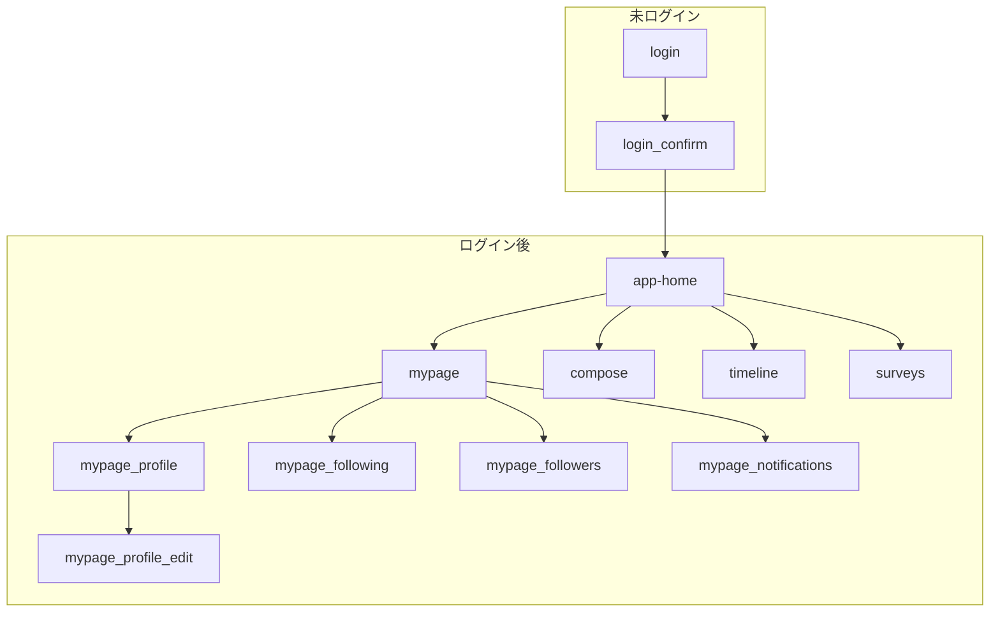

# 02_FRONTEND_SPEC.md: フロントエンド仕様書

## 0. 開発進捗とタスクの共有byえとー

### 雛形ベースができてURLが既に存在するページ
- Home
- Login
  - Login Confirm
- My Page
  - My Page Profile
  - My Page Profile Edit
  - My Page Following
- timeline
- compose
- surveys

### まだ開発中のページ
- 細かいページはFigmaを参照
- page/followers
- page/notifications
- timelineのタブバーの分岐
- surveysのタブバーの分岐

### 今考えられるタスク
- フッターの設定
- 変数、定数の統一
- 画像の位置
- アイコンの調整
- 画像がはみ出しており、サイズ調整が必要
- ボタンを押したときのページ変遷の実装

過去のプルリクエスト一覧でも各々のページにおける課題などが確認できます  
https://github.com/tech0-gen10-papas/papas-frontend/pulls?q=is%3Apr+is%3Aclosed

## 1. 技術スタック

- **フレームワーク:** Next.js (TypeScript, App Router)
- **UIライブラリ:** Tailwind CSS
- **コード品質:** ESLint, Prettier

## 2. ディレクトリ構造

現在の開発環境（Docker利用）・画像と実際のファイル構成を反映したディレクトリ例  
**Next.js App Routerのページ名称に準拠**

```text
papas-frontend/
├─ .devcontainer/
├─ .github/
├─ .next/
├─ node_modules/
├─ papas-docs/
├─ public/
│  ├─ icons/
│  └─ images/
│     ├─ file.svg
│     ├─ globe.svg
│     ├─ next.svg
│     ├─ vercel.svg
│     └─ window.svg
├─ src/
│  ├─ app/
│  │  ├─ login/                  # /login ログイン画面
│  │  │  └─ confirm/             # /login/confirm 認証確認画面
│  │  ├─ home/                   # /home ログイン後のメイン画面
│  │  ├─ timeline/               # /timeline タイムライン
│  │  ├─ compose/                # /compose 新規投稿画面
│  │  ├─ surveys/                # /surveys アンケート機能
│  │  ├─ mypage/                 # /mypage マイページ
│  │  │  ├─ profile/             # /mypage/profile プロフィール
│  │  │  │  └─ edit/             # /mypage/profile/edit プロフィール編集
│  │  │  ├─ following/           # /mypage/following フォロー中
│  │  │  ├─ followers/           # /mypage/followers フォロワー
│  │  │  └─ notifications/       # /mypage/notifications お知らせ
│  │  ├─ favicon.ico
│  │  ├─ globals.css
│  │  ├─ layout.tsx
│  │  └─ page.tsx                # 開発用のリンク確認ページ。Home, Login, My Page, Timeline, Compose, Surveysなど主要ページへの遷移リンクを検証可能
│  ├─ components/
│  │  ├─ ui/
│  │  └─ features/
│  ├─ lib/
│  ├─ styles/
│  ├─ types/
├─ .dockerignore
├─ .gitattributes
├─ .gitignore
├─ Dockerfile
├─ Dockerfile.dev
├─ package.json
├─ package-lock.json
├─ postcss.config.mjs
├─ README.md
├─ tsconfig.json
├─ next.config.ts
├─ eslint.config.mjs
├─ next-env.d.ts
├─ tailwind.config.ts
```

- `src/app/login/`: ログイン画面
  - `src/app/login/confirm/`: 認証確認画面
- `src/app/home/`: ログイン後のメイン画面
- `src/app/timeline/`: タイムライン
- `src/app/compose/`: 新規投稿画面
- `src/app/surveys/`: アンケート機能
- `src/app/mypage/`: マイページ
  - `src/app/mypage/profile/`: プロフィール
    - `src/app/mypage/profile/edit/`: プロフィール編集
  - `src/app/mypage/following/`: フォロー中
  - `src/app/mypage/followers/`: フォロワー
  - `src/app/mypage/notifications/`: お知らせ

> ディレクトリ・URLは英語・小文字・ケバブケース・階層化で統一してください。

## 3. デザインからの実装フロー (Figma -> Code)

1. **デザイン担当:** Figmaでプロトタイプを作成。レイヤー名やコンポーネント名を分かりやすく命名する。
2. **フロントエンド担当:** VS CodeのFigma for VS Code (Dev Mode) を使用し、デザイン定義（色、フォント、レイアウト、CSSコード）を参照しながら実装を進める。
3. GitHub Copilotに「このFigmaのデザインを参考に、Tailwind CSSを使ってヘッダーコンポーネントを作成して」のように指示し、コーディングを効率化する。
4. ディレクトリの名称はFigmaの設計に準拠し、画面ごとに分割・管理する。
   - 作成するファイルのパスは「2. ディレクトリ構造」で定義したルールに従う。
   - 例: プロフィール画面は `src/app/mypage/profile/page.tsx` のようにディレクトリ階層で表現する。
   - ファイル名は原則として `page.tsx`, `layout.tsx`, `loading.tsx` などNext.jsの規則に従う。
   - 大文字やスペースは避け、英語・小文字・ケバブケース（ハイフン区切り）で統一する。

## 4. 画面遷移

画面遷移フロー（ディレクトリ・Figma設計に準拠）



- `/login`: ログイン画面
  - `/login/confirm`: 認証確認画面
- `/home`: ログイン後のメイン画面
- `/timeline`: タイムライン
- `/compose`: 新規投稿画面
- `/surveys`: アンケート機能
- `/mypage`: マイページ
  - `/mypage/profile`: プロフィール
    - `/mypage/profile/edit`: プロフィール編集
  - `/mypage/following`: フォロー中
  - `/mypage/followers`: フォロワー
  - `/mypage/notifications`: お知らせ

> ディレクトリ・URLは英語・小文字・ケバブケース・階層化で統一してください。

## 5. page.tsx以外に更新したファイル

### tailwind.config では下記を更新しました

- ブランドカラー・フォントは Figma デザインに準拠
- Tailwind のカスタムカラーは `brand.*` や `text.*` で統一
- 日本語フォントは `Noto Sans JP` を使用
- グラデーション背景も利用可能
- 設定ファイルは `tailwind.config.ts` で管理（Next.js App Router 対応済み）

### 画像やアイコンのpublic/への格納

- まだ足りてないアイコンなども多いです、適宜更新します。

## 6. API連携

- バックエンドチームが提供する別のmdファイルに記載のAPI仕様に従って、データ連携を実装する。
- 認証にはCookieを利用したJWT認証を採用する。詳細は各mdファイルを参照。

## 7. コンポーネント設計の詳細

- **設計思想:**  
  - Atomic Designを参考に、`src/components/ui` にはAtom、`features`にはMolecule/Organismを配置
  - TODO: 設計思想の詳細を記述
- **具体的なコンポーネント洗い出し:**  
  - 今回は先にページ作成を優先し、後からコンポーネント化する方針
  - `src/components/ui/` 以下に汎用的なUIコンポーネントを配置
    - 例: Button, Input, Modal, Cardなど
  - `src/components/features/` 以下に特定の機能に依存するコンポーネントを配置
    - 例: TimelineItem, SurveyForm, UserProfileなど
  - TODO: Figmaデザインから追加で洗い出し

## 8. スタイリングの詳細方針

- **設定ファイル:**  
  - `tailwind.config.js` にブランドカラー・フォントサイズ・余白単位を定義  
    - Figmaのデザイン値を反映
  - TODO: tailwind.config.jsの記述例

**実装例: tailwind.config.ts**

```typescript
// filepath: tailwind.config.ts
import type { Config } from 'tailwindcss';

const config: Config = {
  content: [
    './src/pages/**/*.{js,ts,jsx,tsx,mdx}',
    './src/components/**/*.{js,ts,jsx,tsx,mdx}',
    './src/app/**/*.{js,ts,jsx,tsx,mdx}',
  ],
  theme: {
    extend: {
      colors: {
        // Figmaで定義されたブランドカラーを追加
        primary: '#4A90E2', // 例: メインの青色
        secondary: '#50E3C2', // 例: アクセントカラー
        text: {
          DEFAULT: '#333333', // 基本のテキスト色
          light: '#777777', // 薄いテキスト色
        },
      },
    },
  },
  plugins: [],
};
export default config;
```

- **クラス名の管理:**  
  - 条件付きクラス名は`clsx`ライブラリで簡潔に記述
  - TODO: クラス名管理のサンプルコード
