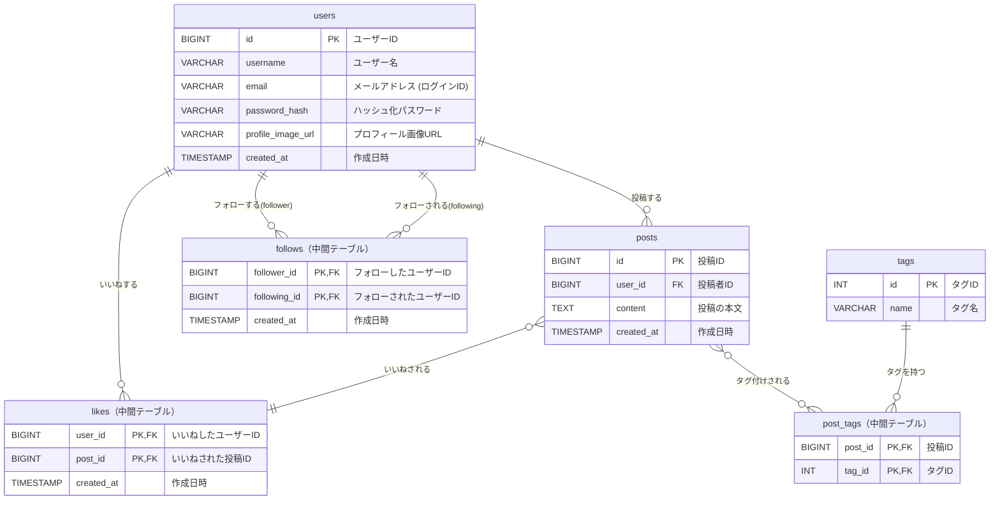

はい、承知いたしました。
ご提示いただいた文章を、見出しやリスト、テーブル、装飾などを活用して、Markdown形式で綺麗に整形しました。

---

# MVP設計：地域SNSアプリの定義とデータベース構成

## 1. MVPのコア機能とスコープ

### アプリのコアバリュー
Figmaのデザインから、このアプリのコア価値は**「地域住民が特定のテーマ（タグ）で情報交換できる小規模なSNS」**だと考えられます。これを検証するために、以下の通りMVP（Minimum Viable Product）のスコープを定義します。

### MVPのスコープ

#### ✅ 実装する機能 (In Scope)
- **ユーザー登録・ログイン**: ユーザーが自分を識別し、投稿できるようにする。
- **投稿機能**: テキスト情報を発信できる。
- **タイムライン**: 全員の投稿や、特定のタグの投稿を閲覧できる。
- **フォロー機能**: 特定のユーザーを追いかけられる。
- **いいね機能**: 簡単なリアクションができる。

#### ❌ 除外・簡略化する機能 (Out of Scope)
- **アンケート機能**: コアではない追加機能のため、除外。
- **ご近所さん機能**: 位置情報に基づく機能は実装コストが高いため、除外。
- **ソーシャルログイン**: ログイン方法は「メールアドレスとパスワード」に絞り、実装を簡略化する。
- **詳細なプロフィール編集**: MVPでは登録時の情報のみでOKとする。

---

## 2. 最小構成データベース設計 (6テーブル)
上記のコア機能を実装するために、テーブルとカラムを最小限に絞り込みます。

### 1. `users` テーブル (ユーザー情報)
ログインとユーザー識別に必要な最低限の情報に絞ります。

| カラム名 | 型 | 説明 |
|:---|:---|:---|
| `id` | `BIGINT` | 主キー (PK) |
| `username` | `VARCHAR(50)` | ユーザー名 |
| `email` | `VARCHAR(255)` | ログインID (ユニーク) |
| `password_hash` | `VARCHAR(255)` | ハッシュ化されたパスワード |
| `profile_image_url` | `VARCHAR(255)` | プロフィール画像のURL (NULL許容) |
| `created_at` | `TIMESTAMP` | 作成日時 |

> 💡 **ポイント**: ソーシャルログイン関連やmyTOKYOGAS顧客番号など、コア機能に直接関係ないカラムを削除しました。

### 2. `posts` テーブル (投稿)
基本のテキスト投稿機能に特化します。

| カラム名 | 型 | 説明 |
|:---|:---|:---|
| `id` | `BIGINT` | 主キー (PK) |
| `user_id` | `BIGINT` | 投稿者ID (FK to `users.id`) |
| `content` | `TEXT` | 投稿の本文 |
| `created_at` | `TIMESTAMP` | 作成日時 |

> 💡 **ポイント**: MVPでは画像や動画は扱わず、テキストのみとすることで実装をシンプルにします。

### 3. `follows` テーブル (フォロー関係)
SNSの基本機能であるため、これはそのまま残します。

| カラム名 | 型 | 説明 |
|:---|:---|:---|
| `follower_id` | `BIGINT` | フォローしたユーザーID (FK to `users.id`) |
| `following_id` | `BIGINT` | フォローされたユーザーID (FK to `users.id`) |
| `created_at` | `TIMESTAMP` | 作成日時 |

> 💡 **ポイント**: マイページの「フォロー数」「フォロワー数」はこのテーブルで実現できます。

### 4. `likes` テーブル (いいね)
エンゲージメントの基本なので残します。

| カラム名 | 型 | 説明 |
|:---|:---|:---|
| `user_id` | `BIGINT` | 「いいね」したユーザーID (FK to `users.id`) |
| `post_id` | `BIGINT` | 「いいね」された投稿ID (FK to `posts.id`) |
| `created_at` | `TIMESTAMP` | 作成日時 |

### 5. `tags` & `post_tags` テーブル (タグ機能)
投稿の分類はアプリの重要な特徴なので、MVPに含めます。

#### `tags` テーブル
| カラム名 | 型 | 説明 |
|:---|:---|:---|
| `id` | `INT` | 主キー (PK) |
| `name` | `VARCHAR(50)` | タグ名 (例: "グルメ", "イベント") |

#### `post_tags` テーブル (中間テーブル)
| カラム名 | 型 | 説明 |
|:---|:---|:---|
| `post_id` | `BIGINT` | 投稿ID (FK to `posts.id`) |
| `tag_id` | `INT` | タグID (FK to `tags.id`) |

> 💡 **ポイント**: この2つのテーブルにより、タイムラインでタグごとの投稿一覧を表示する機能が実現できます。

---

## 3. まとめと次のステップ

### 検証できる価値
この最小構成（6テーブル）により、アプリの最も重要な価値である**「ユーザーが登録し、タグを付けて投稿し、他の人の投稿をフォローしたり、いいねしたりして交流する」**という一連の流れを検証できます。

### 🚀 次のステップ
このMVPがユーザーに受け入れられたら、次のステップとして以下の機能追加を検討します。
- ソーシャルログイン
- プロフィール編集機能の拡充
- アンケート機能
- 画像投稿機能