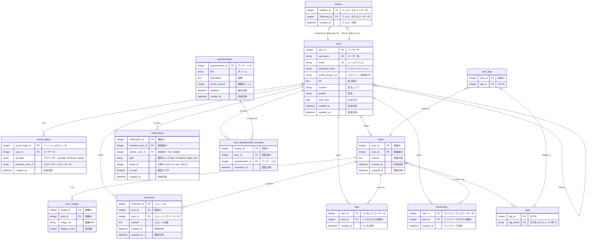

### テーブル設計の解説

#### 1. `users`
- **役割**: アプリケーションのユーザー情報を格納する中心的なテーブルです。
- **カラム**:
  - `user_id`: 各ユーザーを一位に識別するID。
  - `username`, `email`: ログインや識別に利用。重複は許されません (UK: Unique Key)。
  - `password_hash`: パスワードを安全に保存するためのハッシュ化された文字列。
  - その他: プロフィール編集画面にある自己紹介、居住エリア、性別、生年月日などを保存します。

#### 2. `social_logins`
- **役割**: Facebook, Google, Appleなどのソーシャルログイン情報を管理します。
- **リレーション**: `users` テーブルと1対多の関係。1人のユーザーが複数のソーシャルアカウントを連携できます。

#### 3. `posts`
- **役割**: タイムラインに表示される投稿（テキストコンテンツ）を保存します。
- **リレーション**: `users` テーブルと1対多の関係。1人のユーザーが複数の投稿を行えます。

#### 4. `post_images`
- **役割**: 投稿に添付される画像を管理します。1つの投稿に複数画像を添付できるため、別テーブルに切り出します。
- **リレーション**: `posts` テーブルと1対多の関係。

#### 5. `tags` & `post_tags` (中間テーブル)
- **役割**:
  - `tags`: 「#グルメ」「#子育て」などのタグそのものを管理します。
  - `post_tags`: 投稿とタグの多対多の関係を表現するための中間テーブルです。1つの投稿に複数のタグを付けられ、1つのタグは複数の投稿で使われます。
- **リレーション**: `posts` - `post_tags` - `tags` で多対多を表現します。

#### 6. `follows`
- **役割**: ユーザー間のフォロー関係を管理します。誰が(follower_id)誰を(following_id)フォローしているかを記録します。
- **リレーション**: `users` テーブルに対する自己参照的な多対多の関係です。

#### 7. `likes`, `comments`, `bookmarks`
- **役割**: それぞれ投稿に対する「いいね」「コメント」「ブックマーク」のアクションを記録します。
- **リレーション**:
  - `likes`, `bookmarks`: 誰がどの投稿にアクションしたかを記録する中間テーブル。`users` と `posts` に対して多対多の関係を持ちます。
  - `comments`: 誰がどの投稿にコメントしたかと、その内容を記録します。`users` と `posts` に紐づきます。

#### 8. `notifications`
- **役割**: 「いいねされました」「コメントが付きました」といった通知を管理します。
- **カラム**:
  - `recipient_user_id`: 通知を受け取るユーザー。
  - `sender_user_id`: 通知のきっかけとなったアクションを起こしたユーザー（システム通知の場合はNULL）。
  - `type`, `target_id`: 何に対する通知か（例: type='like', target_id=投稿ID）。
- **リレーション**: `users` テーブルと1対多の関係（1人のユーザーが多くの通知を受け取る）。

#### 9. `questionnaires`
- **役割**: 「まちのアンケート」機能のアンケート情報を管理します。タイトル、締切、報酬ポイントなどを持ちます。

#### 10. `user_questionnaire_answers`
- **役割**: どのユーザーがどのアンケートに回答したかを記録する中間テーブルです。
- **リレーション**: `users` と `questionnaires` の多対多の関係を表現します。これにより、ユーザーごとに「未回答」「回答済」のアンケートを区別できます。