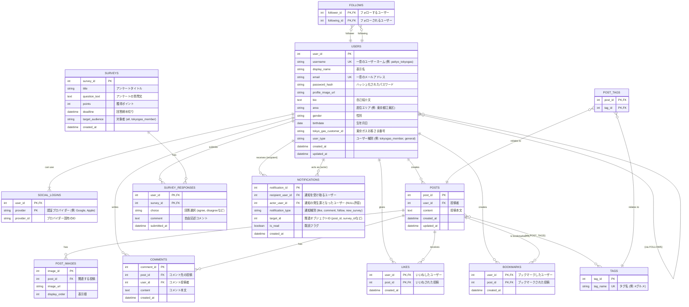

```mermaid
erDiagram
    USERS {
        int user_id PK
        string username UK "一意のユーザーネーム (例: pattyo_tokyogas)"
        string display_name "表示名"
        string email UK "一意のメールアドレス"
        string password_hash "ハッシュ化されたパスワード"
        string profile_image_url
        text bio "自己紹介文"
        string area "居住エリア (例: 東京都江東区)"
        string gender "性別"
        date birthdate "生年月日"
        string tokyo_gas_customer_id  "東京ガスお客さま番号"
        string user_type "ユーザー種別 (例: tokyogas_member, general)"
        datetime created_at
        datetime updated_at
    }

    SOCIAL_LOGINS {
        int user_id PK, FK
        string provider PK "認証プロバイダー (例: Google, Apple)"
        string provider_id "プロバイダー固有のID"
    }

    POSTS {
        int post_id PK
        int user_id FK "投稿者"
        text content "投稿本文"
        datetime created_at
        datetime updated_at
    }

    POST_IMAGES {
        int image_id PK
        int post_id FK "関連する投稿"
        string image_url
        int display_order "表示順"
    }

    TAGS {
        int tag_id PK
        string tag_name UK "タグ名 (例: #グルメ)"
    }

    POST_TAGS {
        int post_id PK, FK
        int tag_id PK, FK
    }

    COMMENTS {
        int comment_id PK
        int post_id FK "コメント先の投稿"
        int user_id FK "コメント投稿者"
        text content "コメント本文"
        datetime created_at
    }

    LIKES {
        int user_id PK, FK "いいねしたユーザー"
        int post_id PK, FK "いいねされた投稿"
        datetime created_at
    }

    BOOKMARKS {
        int user_id PK, FK "ブックマークしたユーザー"
        int post_id PK, FK "ブックマークされた投稿"
        datetime created_at
    }

    FOLLOWS {
        int follower_id PK, FK "フォローするユーザー"
        int following_id PK, FK "フォローされるユーザー"
    }

    SURVEYS {
        int survey_id PK
        string title "アンケートタイトル"
        text question_text "アンケートの質問文"
        int points "獲得ポイント"
        datetime deadline "回答締め切り"
        string target_audience "対象者 (all, tokyogas_member)"
        datetime created_at
    }

    SURVEY_RESPONSES {
        int user_id PK, FK
        int survey_id PK, FK
        string choice "回答選択 (agree, disagreeなど)"
        text comment  "自由記述コメント"
        datetime submitted_at
    }

    NOTIFICATIONS {
        int notification_id PK
        int recipient_user_id FK "通知を受け取るユーザー"
        int actor_user_id FK "通知の発生源となったユーザー (NULL許容)"
        string notification_type "通知種別 (like, comment, follow, new_survey)"
        int target_id "関連オブジェクトID (post_id, survey_idなど)"
        boolean is_read "既読フラグ"
        datetime created_at
    }


    USERS ||--|{ SOCIAL_LOGINS : "can use"
    USERS ||--o{ POSTS : "creates"
    USERS ||--o{ COMMENTS : "writes"
    USERS ||--o{ LIKES : "gives"
    USERS ||--o{ BOOKMARKS : "creates"
    USERS ||--o{ SURVEY_RESPONSES : "submits"
    USERS ||--o{ NOTIFICATIONS : "receives (recipient)"
    USERS ||--o{ NOTIFICATIONS : "acts as (actor)"

    POSTS ||--o{ POST_IMAGES : "has"
    POSTS ||--o{ COMMENTS : "has"
    POSTS ||--o{ LIKES : "receives"
    POSTS ||--o{ BOOKMARKS : "is bookmarked by"

    POSTS }o--o{ TAGS : "(via POST_TAGS)"
    POST_TAGS }o--|| POSTS : "relates to"
    POST_TAGS }o--|| TAGS : "relates to"

    USERS }o--o{ USERS : "(via FOLLOWS)"
    FOLLOWS }o--|| USERS : "follower"
    FOLLOWS }o--|| USERS : "following"


    SURVEYS ||--o{ SURVEY_RESPONSES : "has"
```